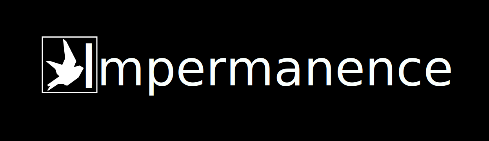

Web App project illustrating the exploration of Impermanence. Built for [ADV201 - Web Design and Interactivity](https://www.deakin.edu.au/courses/unit?unit=ADV201).

Live site: https://impermanence.azurewebsites.net

## Technologies Used

- HTML
- CSS
- JS
- [lax.js](https://github.com/alexfoxy/lax.js)
- [TypewriterJS v2](https://www.npmjs.com/package/typewriter-effect)
- [Smooth Scroll](https://github.com/cferdinandi/smooth-scroll)
